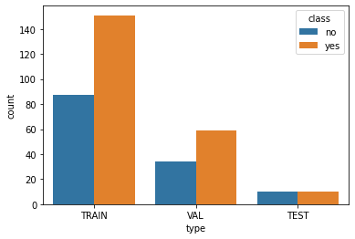

# Brain MRI classification and segmentation

This repository contains two main notebooks. The first one `XX` is about classification: we try to discriminate healthy scans from patients suffering from brain tumor. The second notebook `XX` tries to detect the tumors using a semantic segmentation model.

## Objective

A brain tumor is a collection, or mass, of abnormal cells in your brain. Your skull, which encloses your brain, is very rigid. Any growth inside such a restricted space can cause problems. Brain tumors can be cancerous (malignant) or noncancerous (benign). Malignant tumours are tumours growing rapidly, leading to the destruction of the brain area where they have settled, whereas benign “low-grade” tumours evolve more slowly without causing destruction.

About 5000 new people with primary malignant brain tumour are diagnosed each year in France. The need for a comprehensive and automated method of Brain tumor screening has long been recognized, and previous efforts have made good progress using computer vision.

- With MRI scans as input, we first try to classify the image between tumorous or non tumorous.
- Whe then select only the sick patients and then try to detect the tumor using semantic segmentation. 

source: https://institutducerveau-icm.org/en/brain-tumours/

## Classification

### Installation
### Dataset
- The dataset contains Magnetic resonance imaging (MRI) scans. 
- The dataset comes from the following kaggle competition Source: https://www.kaggle.com/navoneel/brain-mri-images-for-brain-tumor-detection

### Preprocessing

### Model Architecture
We use VGG-

Model
Loss
### Results 

## Segmentation
