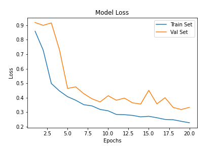

# Brain MRI classification and segmentation

This repository contains two main notebooks. The first one `XX` is about classification: we try to discriminate healthy scans from patients suffering from brain tumor. The second notebook `XX` tries to detect the tumors using a semantic segmentation model.

## Objective

A brain tumor is a collection, or mass, of abnormal cells in your brain. Your skull, which encloses your brain, is very rigid. Any growth inside such a restricted space can cause problems. Brain tumors can be cancerous (malignant) or noncancerous (benign). Malignant tumours are tumours growing rapidly, leading to the destruction of the brain area where they have settled, whereas benign “low-grade” tumours evolve more slowly without causing destruction.

About 5000 new people with primary malignant brain tumour are diagnosed each year in France. The need for a comprehensive and automated method of Brain tumor screening has long been recognized, and previous efforts have made good progress using computer vision.

- With MRI scans as input, we first try to classify the image between tumorous or non tumorous.
- Whe then select only the sick patients and then try to detect the tumor using semantic segmentation. 

source: https://institutducerveau-icm.org/en/brain-tumours/

## Classification

### Dataset
- The dataset contains Magnetic resonance imaging (MRI) scans. 
- The dataset comes from the following kaggle competition Source: https://www.kaggle.com/navoneel/brain-mri-images-for-brain-tumor-detection
- The dataset is really small (about 250 images that we split into train / val / test (0.75 : 0.2 : 0.05)

### Preprocessing
Several transformations are used :
- rotation
- left / right flip
- gamma transformations
- automated cropping as illustrated below

### Model Architecture
- Model: VGG-16
- Loss: binary cross entropy

### Results 
We quickly achieve about 80% of test accuracy. 

## Segmentation
The goal is to detect the tumor pixel-wisely.

### Dataset
This time we use a bigger dataset. The dataset comes from The Cancer Imaging Archive (TCIA). It contains 3930 Brain MRI scans in .tif format along with their corresponding masks

### Preprocessing
Creation of a custom data generator that returns a tuple containing the batch of images and its corresponding batch of masks. 

### Model Architecture
We use a classic model for semantic segmentation: U-net.
Loss: we use the Jaccard loss, particularly helpful for imbalanced classes which is usually the case in segmentation. 
The Jaccard index (also called IoU) is simply the intersection over the union. As we want a loss function that decrease when our predictions are better we use the following expression for the jaccard loss.

### Results

